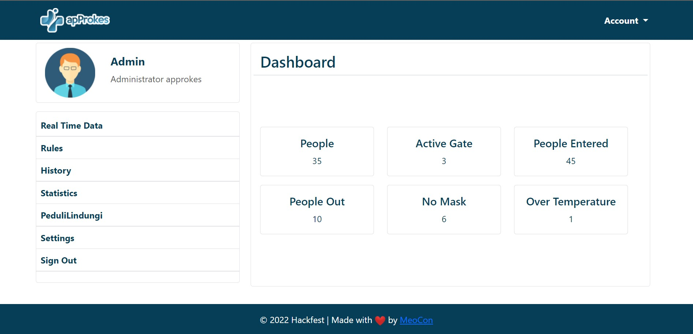
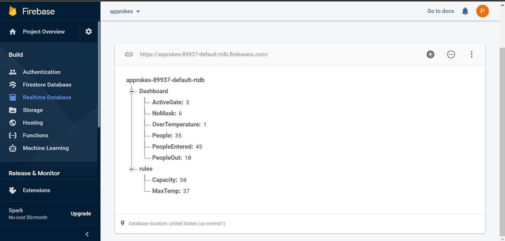
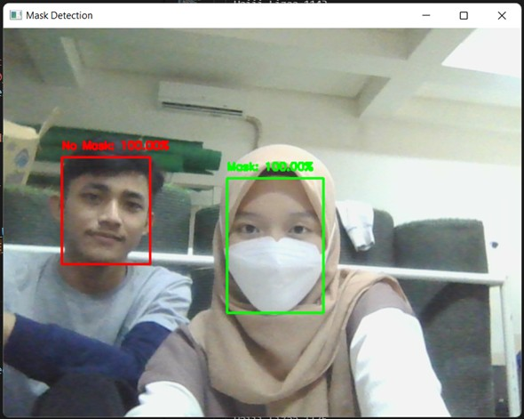

# APPROKES - GDSC Solution Challenge 2022

## Table of Contents
* [General Information](#general-information)
* [Technology Used](#technology-used)
* [Requirements](#requirements)
* [Setup](#setup)
* [Authors](#authors)


## GENERAL INFORMATION
Approkes are a set of tools that are installed at the entrance of the building/room to ensure that everyone who will enter the building has followed the health protocol. The protocols checked are wearing a mask, normal body temperature, using hand sanitizer, and the available room capacity. Visitor data will also be integrated to firebase then can be accesed in website.

This product is a solution proposed by the MeoCon Team in Google Solution Challenge 2022 with a focus on SDG 3 (Good Health and Well-bein) and SDG 9 (Industry, Innovation, and Infrastructure)

Website: [approkes.site](http://approkes.site/) </br>
Full documentation: [Pitch Deck](https://docs.google.com/presentation/d/1wciP4B0OWye8p6DonxSyTiREJlOEnDzP4-jM-VciKpU/edit?usp=sharing)

- Website

- Firebase

- Google Cloud

- Mask Detection Testing



## TECHNOLOGY USED
This system is build with
- [Python3](https://www.python.org)
- [Tensorflow](https://www.tensorflow.org/)
- [Firebase](https://firebase.google.com/)
- [Arduino IDE](https://www.arduino.cc/en/software)
- [Google Cloud Platform](https://cloud.google.com/)

## REQUIREMENTS
### Software
The requirements are listed in ```requirement.txt```
To install, run
```
pip install -r requirements.txt
```
### Hardware
Electrical component:
- Arduino nano
- ESP32
- IR sensor (2)
- Temperature sensor
- Relay (Pump and Solenoid lock)
- Ultrasonic sensor

### HOW TO RUN
- First, clone this repository
    ```
    git clone https://github.com/ahmadaziz6720/hackfest_meocon.git
    ```
- Set up the electrical component above, you can find the used pin in ```src/main.ino```
- Upload ```main.ino``` to arduino nano via Arduino IDE
- Change terminal directory to src, then run
    ```
    python main.py
    ```
    (note: both python and arduino code must have the same COM port and baudrate)

If you have limitations with electrical components, you can still try the real time mask detection. Just follow the instructions in ```src\MaskDetection\README.md```


## STATUS
Project is: _on development_

## AUTHORS
This program was made by <b>MeoCon<b>
- [Ahmad Aziz](mailto:a715210)
- [Putri Nurhaliza](mailto:putriliza05@gmail.com)


note: side repo while build website, https://github.com/ahmadaziz6720/website_approkes.git
